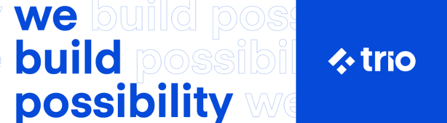

# Trio Challenge - NodeJS Boilerplate

## 📝 Scope
The goal of this project is to act as a starting point to solve the NodeJS Backend "Bike Rent" Trio challenge.

This is a TypeScript application that:

- exposes two Endpoints (_/api/bikes_ and _/api/bikes/[bikeId]_)
- connects to a database to retrieve data

## 🔧 Stack Used

- TypeScript
- Express
- Prisma
- Jest
- Supertest

## 🏃 How to Run the App

### Installing the app

> Please note that the app was created using the following:
>
> NodeJS >= 16.13.2
>
> MySQL >= 8.0.32
>
> To avoid compatibility issues, make sure the version of the tools you are using are up-to-date.

To install the dependencies of the app, you can run `npm install` or `yarn`.

After installing the dependencies, run `db:migrate:dev` to create the migrations on your local database.

### Running the app locally

To run the app locally, you need to execute the following commands:

- `npm run db:migrate:dev` or `yarn run db:migrate:dev`, if you have created any new migrations for the app;
- `npm run start-dev` or `yarn run start-dev`.

### Running the app in production

To run the app in production, you need to execute the following commands:

- `npm run db:migrate:dev` or `yarn db:migrate:dev`, if you have created any new migrations for the app;
- `npm run build` or `yarn build`;
- `npm run start` or `yarn start`.

### Running the tests

To run all tests, you need to execute `npm test` or `yarn test`.

You can also run specific tests with the following commands:

- `npm run test:unit` or `yarn test:unit` runs unit tests, that should be named with the extension `.spec.ts`.
- `npm run test:integration` or `yarn test:integration` runs integration tests, that should be named with the extension `.test.ts`.
- `npm run test:staged` or `yarn test:staged` runs specific tests parsed as parameters.
- `npm run test:ci` or `yarn test:ci` runs all tests creating the code coverage.

## 🍀 That's it! Good luck!